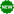
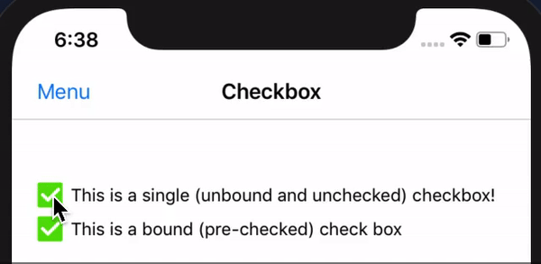
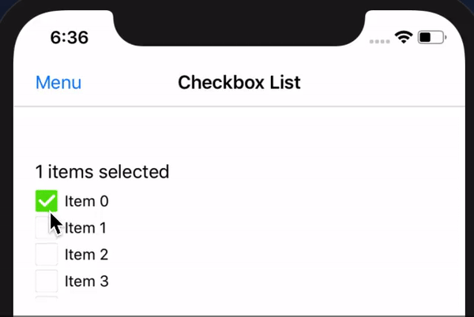
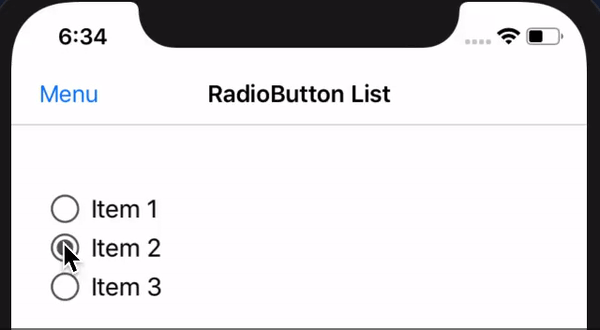

# Prototype.Forms.Controls

This sample app contains a random mixture of Xamarin/Xamarin.Forms controls, views, and functionality snippets that I've created. 

# Table of Contents
1. [ToggleButton](#togglebutton)
2. [Checkbox](#checkbox)  
3. [Checkbox List](#checkboxlist)  
4. [Collapsible/Expandable (Accordion) List](#collapsible-expandable-list)
5. [Editable Label](#editable-label)
6. [ListView with TappedCommand](#listview-command)
7. [ListView with Infinite Scroll](#listview-infinite-scroll)
8. [RadioButtonList](#radiobuttonlist)  
9. [TabControl with Collapsible/Expandable capabilities](#tabcontrol)  


## ToggleButton <a name="togglebutton"></a>

A `ToggleButton` is a control that allows for switching back and forth between images (e.g. 'checked' and 'unchecked' below). `ToggleButton` inherits from `Xamarin.Forms.Button`.

```xml
<controls:ToggleButton 
            x:Name="toggleButton"
            CheckedImage="checked"
            UnCheckedImage="unchecked"
            Enabled="true"
            Animate="false"
            Command="{Binding Source={x:Reference CheckboxControl}, Path=CheckedCommand }" />
```

## Checkbox <a name="checkbox"></a>

The `Checkbox` control is essentially a `StackLayout` that contains a `ToggleButton` and `Label`.

```xml
<controls:Checkbox Text="{Binding CheckboxTitle}" 
                   IsChecked="{Binding IsChecked}" 
                   CheckedCommand="{Binding OnCheckedCommand}" />
```



**Coming Soon**: *Overridable SkiaSharp (default) implementations for Checked/Unchecked states in place of where images are currently required. This will eliminate the need for any platform additions (images).*

## CheckboxList <a name="checkboxlist"></a>

The `CheckboxList` control inherits from `Xamarin.Forms.ListView` and contains a list of `Checkbox` controls. It allows you to bind a collection of `ISelectableItem` object implementations, and maintain a list of selected items. `CheckboxList` contains events and commands observing changes to the `CheckboxList` items. 

```xml
<controls:CheckboxList ItemsSource="{Binding Items}" 
                       SelectedItems="{Binding SelectedItems}" />
```



**Note:** The `CheckboxList` control also contains functionality for selecting/de-selecting all of the checkboxes in the list. (Documentation and samples coming soon for this).

## Collapsible/Expandable (Accordion) List <a name="collapsible-expandable-list"></a>

(Coming soon!)

## Editable Label <a name="editable-label"></a>

(Coming soon!)

## ListView with Item Tapped Command <a name="listview-command"></a>

(Coming soon!)

## ListView with Infinite Scroll <a name="listview-infinite-scroll"></a>

(Coming soon!)

## RadioButtonList <a name="radiobuttonlist"></a>

The `RadioButtonList` inherits from `StackLayout`, and contains a list of `RadioButton` controls. The `ItemsSource` property within the `RadioButtonList` expects `IEnumerable<string>`. The collection of strings is used to create the `RadioButton` items contained within the `RadioButtonList`.

```xml
<controls:RadioButtonList ItemsSource="{Binding Items}"  />
```



**Note:** The `RadioButton` control requires custom renderering within the iOS and Android projects.

**Coming Soon:** I will be expanding the functionality of the to allow for more options (i.e. pre-selecting radio button items, custom selected/unselected formatting, etc.)

## TabControl with Collapsible/Expandable capabilities <a name="tabcontrol"></a>

(Coming soon!)
